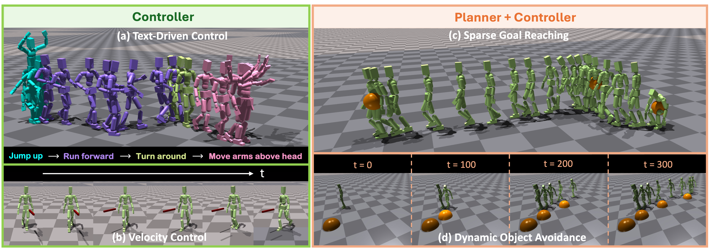

<h1 align="center">UniPhys: Unified Planner and Controller with Diffusion for Flexible Physics-Based Character Control</h1>
<p align="center">
  <p align="center">
    <a href="https://wuyan01.github.io/">Yan Wu<sup>1</sup></a>
    ·
    <a href="https://korrawe.github.io/">Korrawe Karunratanakul<sup>1</sup></a>
    ·
    <a href="https://www.zhengyiluo.com/">Zhengyi Luo<sup>2</sup></a>
    ·
    <a href="https://vlg.inf.ethz.ch/team/Prof-Dr-Siyu-Tang.html">Siyu Tang<sup>1</sup></a>
    <br/>
    <sup>1</sup>ETH Zurich <sup>2</sup>CMU
  </p>
  <h4 align="center">ICCV 2025 Highlight</h4>
  <h3 align="center"><a href="https://arxiv.org/abs/2504.12540">Paper</a> | <a href="https://wuyan01.github.io/uniphys-project/">Project Page</a> | <a href="https://huggingface.co/datasets/yan0116/AMASS_SMPL-Humanoid_state-action-pairs">Dataset</a></h3>
</p>

This is official implementation of ICCV 2025 hightlight paper [UniPhys: Unified Planner and Controller with Diffusion for Flexible Physics-Based Character Control](https://wuyan01.github.io/uniphys-project/). In this work, we build a unified diffusion-based policy for the end-to-end control of physics-based character, enabling zero-shot generalization to diverse tasks.

<p align="center">
  
</p>

## 🚀 Setup
This codebase was tested on Ubuntu 20.04, using PyTorch 2.3.1 with CUDA 12.1.
1. Create a conda environment and install dependencies:

```
conda create python=3.8 -n uniphys
conda activate uniphys
conda install pytorch==2.3.1 torchvision==0.18.1 torchaudio==2.3.1 pytorch-cuda=12.1 -c pytorch -c nvidia
cd poselib && pip install -e . && cd ..
cd isaac_utils && pip install -e . && cd ..
pip install -r requirements.txt
```

2. Install and setup [Isaac Gym](https://developer.nvidia.com/isaac-gym)

3. Download SMPL Models:
  * Download [SMPL v1.1.0](https://smpl.is.tue.mpg.de/) and [SMPLX v1.1](https://smpl-x.is.tue.mpg.de/index.html) models
  * Rename the SMPL modesl `basicmodel_neutral_lbs_10_207_0_v1.1.0`, `basicmodel_male_lbs_10_207_0_v1.1.0`, `basicmodel_female_lbs_10_207_0_v1.1.0` to `SMPL_NEUTRAL.pkl`, `SMPL_MALE.pkl`, `SMPL_FEMALE.pkl` respectively.
  * Place SMPL and SMPLX models under `data/smpl` with the following file structure:

  ```
  |-- data
      |-- smpl
          |-- SMPL_FEMALE.pkl
          |-- SMPL_NEUTRAL.pkl
          |-- SMPL_MALE.pkl
          |-- SMPLX_FEMALE.pkl
          |-- SMPLX_NEUTRAL.pkl
          |-- SMPLX_MALE.pkl
  ```

4. Download pretrained model and some necessary files using the `download_data.sh` script.
```
sh download_data.sh
```

## 🔥 Quick Start with Pretrained Model
Explore our pretrained model to control the character in different tasks. 

Our policy supports text-driven atomic skills and interactive text-driven control to compose different skills, and can generalize to different tasks like goal reaching, velocity control and obstacle avoidance.

### 🎲 Unconditional ramdom rollouts
By setting `diffusion_forcing.algorithm.guidance_params=0.0`, the diffusion policy will randomly generate diverse motions.
```
python main.py \
phc/env=env_im_vae \
phc.learning.params.seed=12 \
phc.env.num_envs=9  \
phc.headless=False \
phc.env.episode_length=500 \
diffusion_forcing/algorithm=df_humanoid \
diffusion_forcing.algorithm.guidance_params=0.0 \
diffusion_forcing.load="output/UniPhys/checkpoints/uniphys_T32.ckpt" \
diffusion_forcing.algorithm.diffusion.use_ema=False \
diffusion_forcing.task="interact" \
+diffusion_forcing.name=play_t2m_unconditional
```

### 📝 Text-driven control
Our policy supports text-driven control, and you can set text prompts by setting `+diffusion_forcing.algorithm.text_prompt=$TEXT_PROMPT` with a non-zero `guidance_params` (default is 2.5).
```
python main.py \
phc/env=env_im_vae \
phc.learning.params.seed=12 \
phc.env.num_envs=1  \
phc.headless=False \
phc.env.episode_length=500 \
diffusion_forcing/algorithm=df_humanoid \
diffusion_forcing.algorithm.guidance_params=2.5 \
diffusion_forcing.load="output/UniPhys/checkpoints/uniphys_T32.ckpt" \
diffusion_forcing.algorithm.diffusion.use_ema=False \
diffusion_forcing.task="interact" \
+diffusion_forcing.algorithm.text_prompt="walk" \
+diffusion_forcing.name=play_t2m_single_text
```

### 💬 Interactive Text Control
Enable interactive text prompting with `+diffusion_forcing.algorithm.interactive_input_prompt=True`.

```
python main.py \
phc/env=env_im_vae \
phc.learning.params.seed=12 \
phc.env.num_envs=1  \
phc.headless=False \
phc.env.episode_length=5000 \
diffusion_forcing/algorithm=df_humanoid \
diffusion_forcing.load="output/UniPhys/checkpoints/uniphys_T32.ckpt" \
diffusion_forcing.algorithm.diffusion.use_ema=False \
diffusion_forcing.task="interact" \
diffusion_forcing.algorithm.guidance_params=2.5 \
+diffusion_forcing.algorithm.interactive_input_prompt=True \
+diffusion_forcing.name=play_t2m_interactive
```
When this option is enabled, you can dynamically change text prompts and compose new actions during simulation.

* Press `Q` in the simulator visualization window to pause the simulation.

* The terminal will display: `Enter the text prompt:`

* Type your new prompt and press Enter.

The simulation will then resume with the updated text command.

**Note:** Introducing new prompts during ongoing dynamic motions may result in lost balance or falls. Issue new commands during stable motion phases.

### 📍 Goal Reaching
```
python main.py \
phc/env=env_im_vae_goal \
phc.learning.params.seed=12 \
phc.env.num_envs=1  \
phc.headless=False \
phc.env.episode_length=900 \
diffusion_forcing/algorithm=df_humanoid_goal \
diffusion_forcing.load="output/UniPhys/checkpoints/uniphys_T32.ckpt" \
diffusion_forcing.algorithm.diffusion.use_ema=False \
diffusion_forcing.task="interact" \
+diffusion_forcing.name=play_goal_reaching
```

### 🏎️ Velocity Control
```
python main.py \
phc/env=env_im_vae_steer \
phc.learning.params.seed=12 \
phc.env.num_envs=1  \
phc.headless=False \
phc.env.episode_length=3000 \
diffusion_forcing/algorithm=df_humanoid_steer \
diffusion_forcing.load="output/UniPhys/checkpoints/uniphys_T32.ckpt" \
diffusion_forcing.algorithm.diffusion.use_ema=False \
diffusion_forcing.task="interact" \
+diffusion_forcing.name=play_steering
```

### 🚧 Dynamic-object Avoidance
```
python main.py \
phc/env=env_im_vae_obstacle \
phc.learning.params.seed=12 \
phc.env.num_envs=1  \
phc.headless=False \
phc.env.episode_length=3000 \
diffusion_forcing/algorithm=df_humanoid_obstacle \
diffusion_forcing.load="output/UniPhys/checkpoints/uniphys_T32.ckpt" \
diffusion_forcing.algorithm.diffusion.use_ema=False \
diffusion_forcing.task="interact" \
+diffusion_forcing.name=play_obstacle_avoidance
```

## 🏋️‍♂️ Train your own policy
### Dataset Download and Construction

1. Download our preprocessed training dataset, which contains state-action-text pairs constructed from BABEL training and validation set.
```
python scripts/data_process/download_babel_dataset.py
```

* To replay the packaged offline BABEL dataset along with frame-level text annotation:
```
python scripts/vis/replay_babel_state_action_text_pairs.py --load_motion_path data/babel_state-action-text-pairs/babel_train.pkl
```

2. \[optional\] We also provide the [state-action pairs for the full AMASS dataset](https://huggingface.co/datasets/yan0116/SMPL_Humanoid_offline_dataset) (excluding infeasible motions such as climbing stairs or leaning on objects) on Hugging Face. You can download the complete list of AMASS motions and reconstruct the dataset from scratch if desired.

In this work, we build the training dataset with text annotations from the BABEL training set, but you can also create your own customized training dataset using the raw AMASS state-action pairs to suit your needs.

* Download [BABEL dataset](https://babel.is.tue.mpg.de/data.html), and put it under `data/` with the following data structure:
```
|-- data
    |-- babel_v1-0_release
        |-- babel_v1.0_release
            |-- train.json
            |-- val.json
            |-- ...
    |-- smpl
        |-- SMPL_FEMALE.pkl
        |-- SMPL_NEUTRAL.pkl
        |-- SMPL_MALE.pkl
        |-- SMPLX_FEMALE.pkl
        |-- SMPLX_NEUTRAL.pkl
        |-- SMPLX_MALE.pkl
```

* Run the following script to download the AMASS state-action pairs and construct training dataset with BABEL text annotation.
```
python scripts/data_process/construct_babel_training_from_tracked_amass.py
```

* To replay the offline AMASS sequence:
```
python scripts/vis/replay_amass_state_action_pairs.py --load_motion_path data/amass_state-action-pairs/$YOUR_FILE_PATH
```

### Policy Training
```
python main.py \
phc/env=env_im_vae \
phc.learning.params.seed=12345 \
phc.env.num_envs=50  \
phc.headless=True \
phc.im_eval=False \
phc.env.episode_length=3000 \
diffusion_forcing/experiment=exp_isaac \
diffusion_forcing/dataset=isaac_babel \
diffusion_forcing/algorithm=df_humanoid \
diffusion_forcing.algorithm.diffusion.model_type="dec" \
diffusion_forcing.algorithm.guidance_params=0 \
diffusion_forcing.dataset.data_path_list="data/babel_state-action-text-pairs/babel_train.pkl" \
diffusion_forcing.dataset.skip_text=False \
diffusion_forcing.dataset.n_frames=32 \
diffusion_forcing.dataset.stride=10 \
+diffusion_forcing.dataset.load_key_actions=null \
diffusion_forcing.task="training" \
+diffusion_forcing.name=uniphys
```
We evaluate the policy every 100 training epochs with unconditional random generation, and the training loss and evaluation metrics (episode lengths) are logged with Wandb.


## Acknowledgements
Our code build upon these great repositories:
- Simulation environment setup and tracking policy is from: [PULSE](https://github.com/ZhengyiLuo/PULSE)
- Policy training paradigm is build upon: [Diffusion Forcing](https://github.com/buoyancy99/diffusion-forcing)

## Citation
```
@inproceedings{wu2025uniphys,
  title={UniPhys: Unified Planner and Controller with Diffusion for Flexible Physics-Based Character Control},
  author={Wu, Yan and Karunratanakul, Korrawe and Luo, Zhengyi and Tang, Siyu},
  booktitle = {Proceedings of the IEEE/CVF International Conference on Computer Vision (ICCV)},
  year={2025}
}

```
